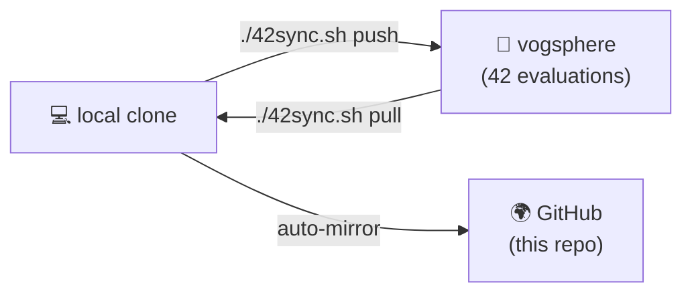

<div align="center">


<br/><br/>


</div>

## 👨‍🚀 About

Welcome to my **42 School Common Core** - every project of the **42 cursus** at **42 Abu Dhabi**, in one place.

At 42 there are no teachers, no lectures and no courses: you learn **C, C++, Unix, algorithms, networking and DevOps** by building everything yourself and defending it in peer evaluations. This repo is mirrored **directly from the campus git server (vogsphere)** with the **full, unedited commit history** - so you're not just seeing final solutions, you can watch every project evolve commit by commit. 🧠

> 🎯 **Why this repo exists:** to track my progress, and to help other 42 students *understand* the projects - not to be copy-pasted (see the [disclaimer](#%EF%B8%8F-disclaimer)).

## 🗺️ The Roadmap

| 🪐 Project | 🧩 What it teaches | 📌 Status |
|---|---|---|
| [**Libft**](./libft) | Rebuilding the C standard library from zero | ✅ **in this repo** |
| [**ft_printf**](./ft_printf) | Variadic functions, formatting, parsing | ✅ **in this repo** |
| [**get_next_line**](./get_next_line) | File descriptors, buffers, static variables | ✅ **in this repo** |
| [**Born2beRoot**](./born2beroot) | Sysadmin, virtualization, hardening 🛡️ | ✅ **in this repo** |
| [**minitalk**](./minitalk) | UNIX signals, client-server IPC 📡 | ✅ **in this repo** |
| [**push_swap**](./push_swap) | Sorting algorithms & complexity ⚙️ | ✅ **in this repo** |
| [**fract-ol**](./fract-ol) | Graphics & complex numbers with MiniLibX 🌀 | ✅ **in this repo** |
| [**minishell**](./minishell) | Writing your own bash 🐚 | ✅ **in this repo** |
| [**Philosophers**](./philosophers) | Threads, mutexes, deadlocks 🍝 | ✅ **in this repo** |
| [**NetPractice**](./netpractice) | TCP/IP addressing & subnetting 🌐 | ✅ **in this repo** |
| [**cub3d**](./cub3d) | Raycasting - a 3D maze like Wolfenstein 🎮 | ✅ **in this repo** |
| [**CPP Module 00**](./cpp-module-00) | C++ basics, classes, `std::string` | ✅ **in this repo** |
| [**CPP Module 01**](./cpp-module-01) | Memory, references, pointers to members | ✅ **in this repo** |
| [**CPP Module 02**](./cpp-module-02) | Ad-hoc polymorphism, operator overloading | ✅ **in this repo** |
| [**CPP Module 03**](./cpp-module-03) | Inheritance 🧬 | ✅ **in this repo** |
| [**CPP Module 04**](./cpp-module-04) | Subtype polymorphism, abstract classes | ✅ **in this repo** |
| **CPP Module 05** | Exceptions & nested classes | 🚧 in progress at 42 |
| **CPP Modules 06-09** | Casts, templates, STL containers | 🔮 coming |
| **Inception** | Docker, docker-compose, infrastructure 🐳 | 🔮 coming |
| **webserv / ft_irc** | Your own HTTP server / IRC server | 🔮 coming |
| **ft_transcendence** | Full-stack web app - the final boss 👑 | 🔮 coming |

*The table fills up as projects land here - hit `Watch` 👀 to follow along.*

## 🔄 How the mirror works

Vogsphere (42's git server) has no GitHub integration, so I built [`42sync.sh`](./42sync.sh) - a small `git subtree` tool that keeps this repo and 42 in sync. **One command submits to 42 and updates GitHub at the same time:**



```bash
./42sync.sh add  cpp-module-01 '<vogsphere-url>'   # import a project WITH its history
./42sync.sh push cpp-module-05                     # submit to 42 + mirror here, one command
./42sync.sh pull cpp-module-05                     # grab commits pushed from another clone
```

Fellow 42 students: it's campus-agnostic - point it at your own vogsphere URLs and enjoy. ⭐

## 🛠️ Tech I'm working with

<div align="center">


</div>

## ⚠️ Disclaimer

This repository is for **learning and reference**. If you're a 42 student: struggle first, peek later - submitting code you can't defend will end badly in evals (and Moulinette has seen everything 🤖). Use it to compare approaches *after* you've fought the project yourself.

## 🤝 Connect

Found something useful? **Leave a ⭐ - it genuinely helps other students find this repo.**

📍 42 intra: `mamuzamm` · 🐙 GitHub: [@m4hdhi](https://github.com/m4hdhi)

<div align="center">


</div>
